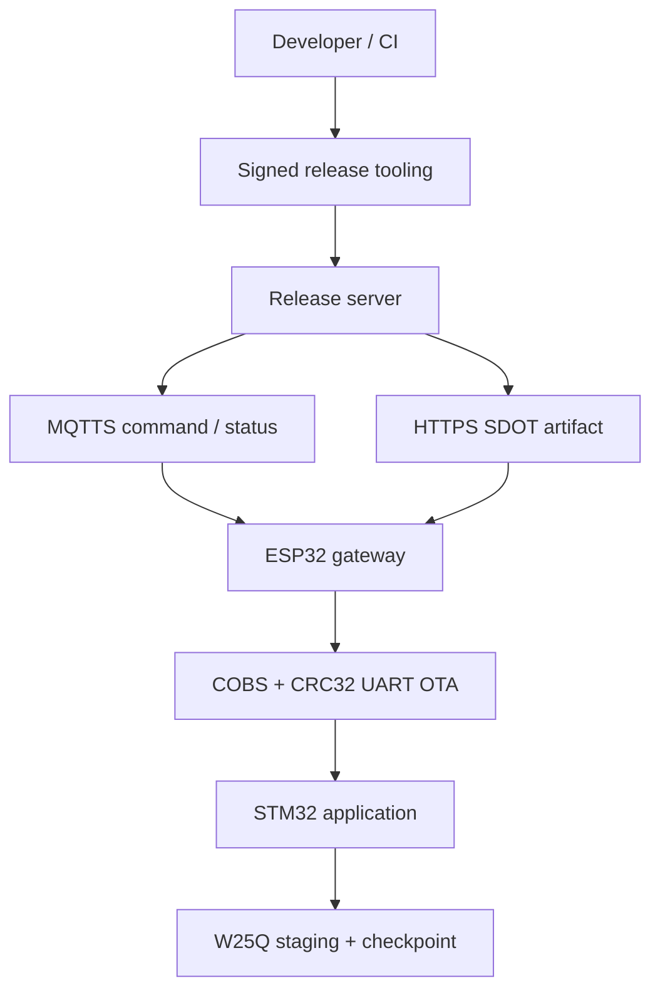
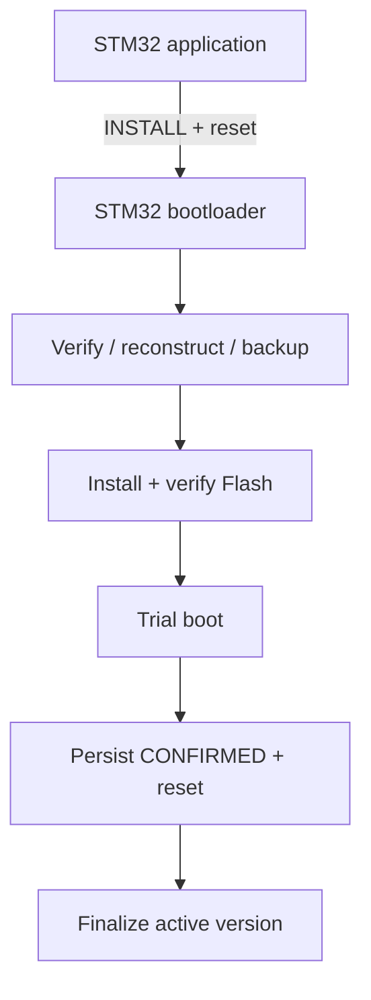
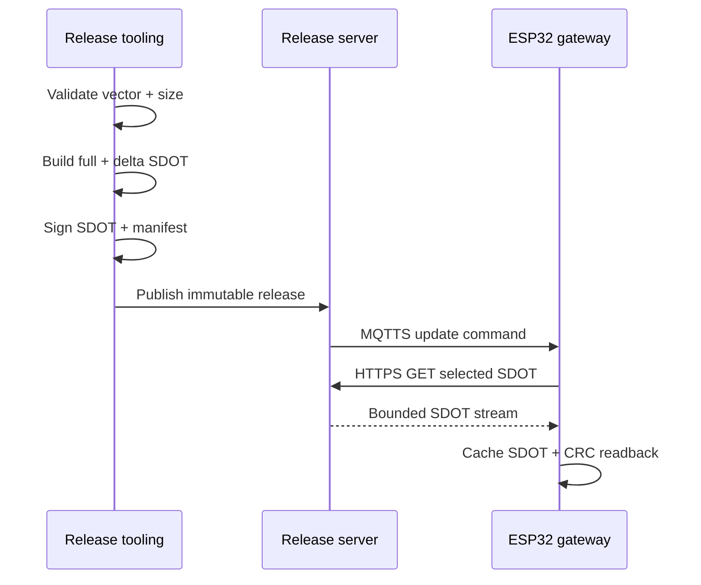
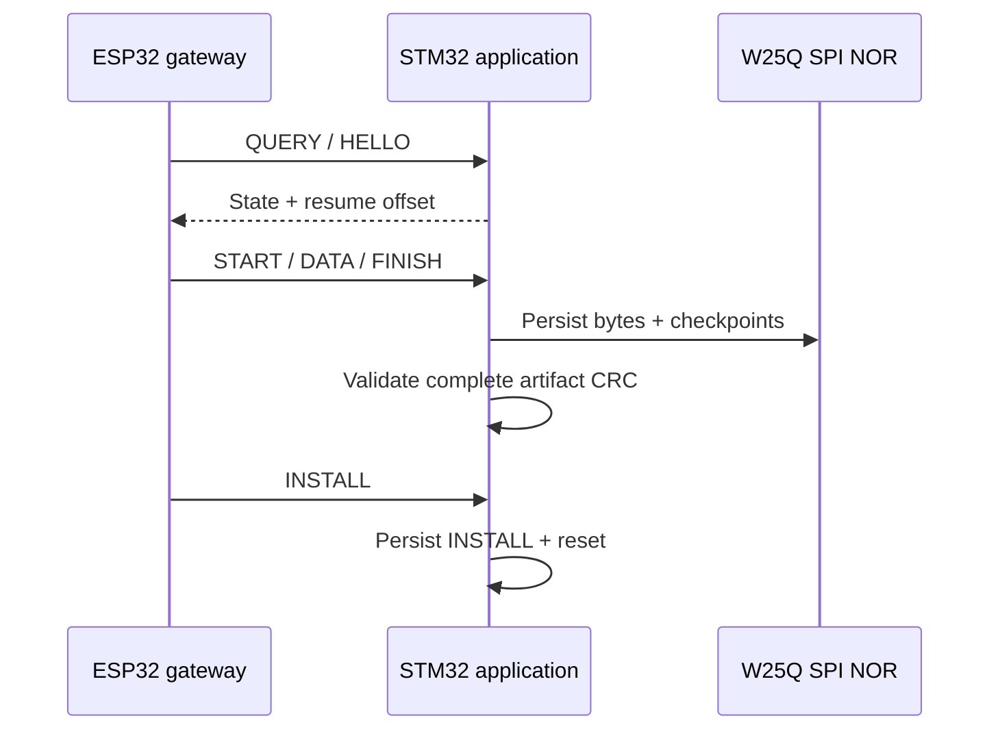
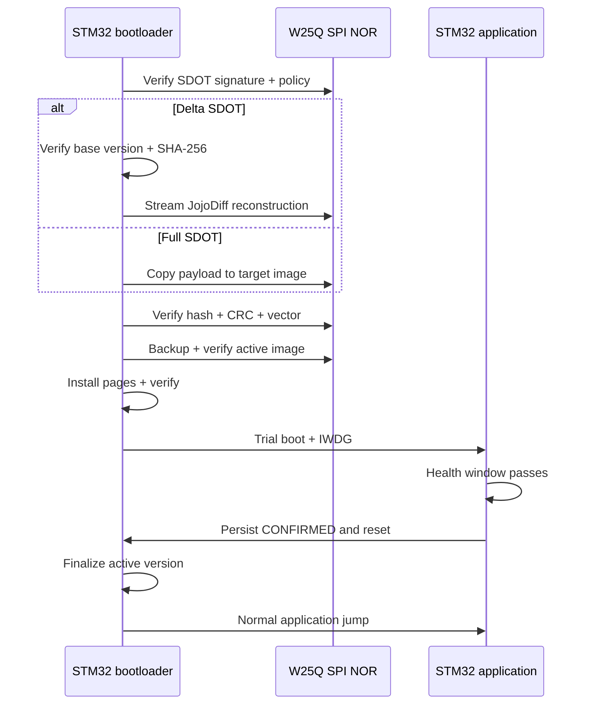
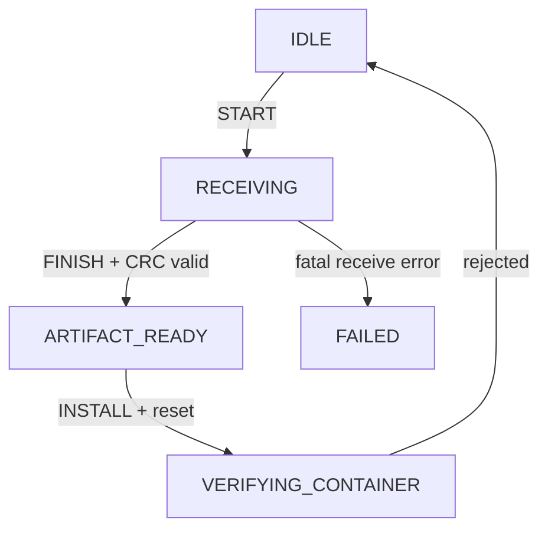
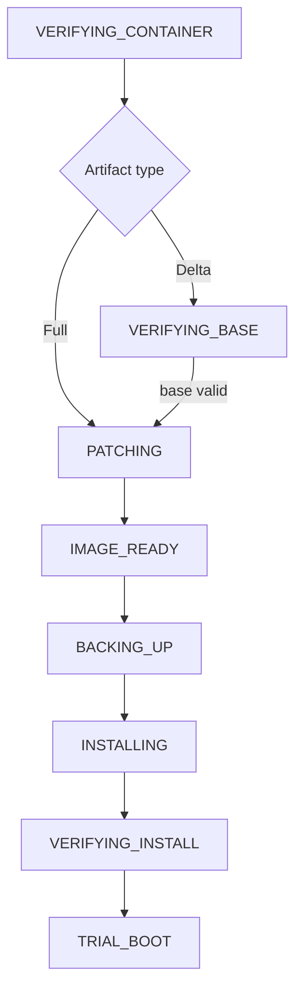
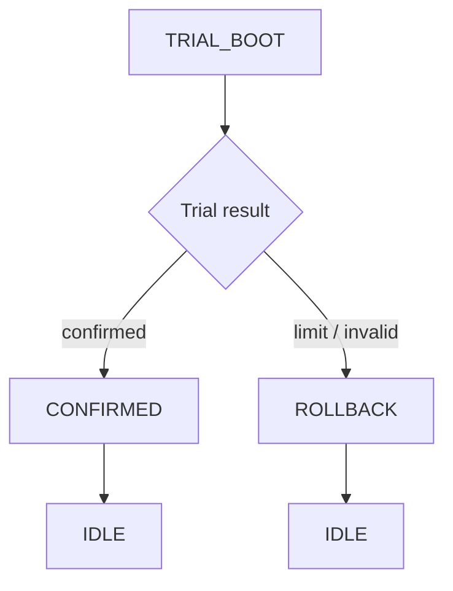

# Secure Delta OTA Bootloader

> **Scope:** Hardware-validated secure full/delta OTA for an STM32F103C8T6 node, with an ESP32 network gateway, external SPI NOR staging, signed release tooling, resumable UART transport, trial boot, rollback, deterministic fault injection, and reproducible benchmark evidence.

## Table of contents

- [Project status](#project-status)
- [System architecture](#system-architecture)
- [Trust boundaries](#trust-boundaries)
- [End-to-end update flow](#end-to-end-update-flow)
- [STM32 boot and recovery model](#stm32-boot-and-recovery-model)
- [Memory map](#memory-map)
- [UART OTA protocol](#uart-ota-protocol)
- [Signed SDOT container](#signed-sdot-container)
- [Delta reconstruction](#delta-reconstruction)
- [ESP32 gateway](#esp32-gateway)
- [Release server and tooling](#release-server-and-tooling)
- [Build, test, and hardware workflows](#build-test-and-hardware-workflows)
- [Measured results](#measured-results)
- [Repository map](#repository-map)
- [Documentation](#documentation)
- [Security boundaries and known limits](#security-boundaries-and-known-limits)
- [References](#references)

## Project status

The repository is presented as one integrated OTA system rather than as isolated firmware examples. The checked-in evidence records:

- deterministic hardware fault matrix: **9/9 PASS**;
- signed full-image OTA: implemented;
- signed delta OTA: implemented;
- ECDSA P-256 firmware authentication on STM32: implemented;
- exact-base SHA-256 validation before delta reconstruction: implemented;
- receive resume from persistent checkpoints: implemented;
- reset-safe reconstruction, backup, install, and rollback paths: implemented;
- trial boot with automatic rollback after repeated unconfirmed boots: implemented;
- MQTTS command/status path and HTTPS artifact path through ESP32: implemented;
- immutable signed release directory and manifest verification: implemented;
- warning-clean STM32 build gate and reproducible benchmark: implemented.

The repository intentionally ships with an **unprovisioned firmware trust anchor**. A production public key must be generated/provisioned separately; no signing private key belongs in this repository.

## System architecture

The system has two linked paths: release/transport and on-device installation/recovery.

**Release and transport path**



**Installation and recovery path**



The responsibilities are deliberately split:

| Layer | Owns | Does not own |
|---|---|---|
| Release tooling | image validation, JojoDiff generation, SDOT signing, manifest signing, immutable release creation | device installation policy |
| Release server | release verification, HTTPS file serving, MQTTS command publication | firmware trust decision |
| ESP32 gateway | Wi-Fi, time sync, MQTTS orchestration, HTTPS download, persistent cache, UART transfer | firmware signing key, final authenticity decision |
| STM32 application | UART receiver, packet/order checks, staging, download checkpoint, install handoff, health confirmation | active-image erase/install |
| STM32 bootloader | SDOT authenticity, product/version/base policy, reconstruction, backup, install, verification, trial/rollback | network transport |
| W25Q SPI NOR | incoming artifact, reconstructed target, verified backup, external metadata/checkpoints | final execution |

## Trust boundaries

The system separates **transport integrity** from **firmware authenticity**.

```text
MQTTS / HTTPS / UART
        |
        | transport + orchestration
        v
ESP32 pre-checks and STM32 packet CRC32
        |
        | not sufficient for firmware trust
        v
STM32 bootloader
        |
        +-- product ID / HW revision
        +-- anti-downgrade policy
        +-- ECDSA P-256 signature
        +-- SHA-256 target image
        +-- SHA-256 base image for delta
        +-- vector-table sanity
        v
installation authority
```

CRC32 is used to detect accidental corruption in packets, stored records, artifacts, and reconstructed data. Authenticity is provided by ECDSA P-256 over the signed SDOT bytes, with SHA-256 binding image content.

The checked-in bootloader trust-anchor header is intentionally unprovisioned:

```c
#define TRUSTED_KEY_PROVISIONED 0U
#define TRUSTED_KEY_ID          0UL
```

The private signing key is required to live outside the repository. `tools/release.py` rejects a private key inside the repo and, on POSIX hosts, requires permissions of `0600` or stricter.

## End-to-end update flow

The update lifecycle crosses three distinct ownership boundaries.

**Release publication and gateway acquisition**



**UART staging on STM32**



**Bootloader verification, installation, and trial closure**



The gateway selects an exact-base delta only when it exists and is appropriate; the release always includes a signed full-image fallback.

## STM32 boot and recovery model

Persistent boot metadata defines the recovery point. The implemented states are the values in `shared/include/boot_metadata.h`.

The persistent state machine has three stages: artifact reception, candidate preparation/installation, and trial closure.

**Artifact reception and container acceptance**



While the boot metadata state is `RECEIVING`, accepted `DATA` frames and resume activity advance the persisted receive offset without changing the boot state.

**Candidate reconstruction and installation**



**Trial confirmation or rollback**



Key recovery invariants:

- boot metadata uses two independent 1 KiB internal-Flash pages with CRC32 and a monotonic generation number;
- download checkpoints use redundant records in the external metadata sectors;
- reconstruction is replayable because it writes only the external reconstructed partition;
- backup is verified before active application erase begins;
- backup progress is committed at 4 KiB external-Flash sector boundaries;
- install and rollback progress are committed at 1 KiB STM32 internal-Flash page boundaries;
- `active_version` is not promoted merely because installation completed;
- each trial jump persists `boot_attempts` before execution and starts the IWDG;
- the maximum number of unconfirmed trial attempts is `3`;
- rollback restores the exact 38 KiB application region from the validated backup.

See [Boot and Update State Machine](docs/boot-state-machine.md) and [Persistent Metadata and Boot Decision](docs/metadata-and-boot-decision.md).

## Memory map

### STM32F103C8T6 internal Flash

| Region | Address range | Size | Purpose |
|---|---|---:|---|
| Bootloader | `0x08000000`–`0x08005FFF` | 24 KiB | secure boot/install/recovery authority |
| Application | `0x08006000`–`0x0800F7FF` | 38 KiB | active product firmware |
| Metadata A | `0x0800F800`–`0x0800FBFF` | 1 KiB | boot metadata slot A |
| Metadata B | `0x0800FC00`–`0x0800FFFF` | 1 KiB | boot metadata slot B |

SRAM is `20 KiB` at `0x20000000`–`0x20004FFF`.

### External SPI NOR logical layout

The OTA logic intentionally uses a fixed **4 MiB logical map**, so both W25Q32 and the tested larger W25Q64 device can use the same layout.

| Region | Address range | Size | Purpose |
|---|---|---:|---|
| External metadata A | `0x000000`–`0x000FFF` | 4 KiB | install handoff + receive checkpoint copy A |
| External metadata B | `0x001000`–`0x001FFF` | 4 KiB | install handoff + receive checkpoint copy B |
| Incoming artifact | `0x002000`–`0x021FFF` | 128 KiB | full/delta SDOT |
| Reconstructed image | `0x022000`–`0x041FFF` | 128 KiB | verified target before install |
| Backup image | `0x042000`–`0x061FFF` | 128 KiB | prior application + backup record |
| Update logs | `0x062000`–`0x071FFF` | 64 KiB | bounded diagnostics/reserved logging |
| Reserved | `0x072000`–`0x3FEFFF` | remainder | future use |
| Flash self-test sector | `0x3FF000`–`0x3FFFFF` | 4 KiB | destructive storage self-test |

See [Memory Map](docs/memory-map.md) and [External SPI Flash](docs/external-spi-flash.md).

## UART OTA protocol

The wire protocol is shared conceptually between `shared/include/ota_protocol.h`, the STM32 application codec, and the ESP32 `uart_ota` component.

| Property | Value |
|---|---|
| UART | 115200, 8-N-1 |
| Framing | COBS payload followed by `0x00` delimiter |
| Packet magic | `0xA55A` |
| Protocol version | `1` |
| Header size | `16 B` |
| Max DATA payload | `256 B` |
| Packet trailer | IEEE CRC32, `4 B` |
| Max encoded frame | `320 B` |
| Retry count | `5` |
| Normal response timeout | `1500 ms` |

Commands: `HELLO`, `QUERY`, `START`, `DATA`, `FINISH`, `ABORT`, `RESUME`, `INSTALL`, `STATUS`, `CONFIRM`, `ACK`, and `NACK`.

The receiver enforces `update_id`, sequence, exact next offset, total artifact size, and duplicate-data consistency. Completed receive boundaries are persisted so transfer can resume after reset.

See [Custom UART OTA Protocol v1](docs/uart-ota-protocol.md).

## Signed SDOT container

The implemented container is `SDOT v1` plus the `SCX1` extension.

| Field group | Purpose |
|---|---|
| Fixed header (`120 B`) | format, identity, versions, sizes, hashes, algorithms |
| SCX1 extension (`20 B`) | key ID, exact base-image size, target-image CRC32 |
| Payload | full image bytes or JojoDiff patch stream |
| Signature (`64 B`) | raw ECDSA P-256 `r || s` |

The total header size is `140 B`. Secure builds allow only `ECDSA P-256` signatures with SHA-256 and reject unsigned legacy containers by default.

The signature covers:

```text
fixed header + SCX1 extension + payload
```

For delta SDOT, the header binds both the exact base-image SHA-256 and the final target-image SHA-256. For full SDOT, the payload is the target image itself.

See [Secure Firmware Container Specification v1](docs/firmware-container.md).

## Delta reconstruction

Host-side `tools/jojodiff_patch.py` emits the JojoDiff stream subset implemented by the STM32 JANPatch-compatible adapter:

- `EQL` — copy unchanged source bytes;
- `MOD` — replace source bytes;
- `INS` — insert target bytes;
- `DEL` — skip source bytes;
- `BKT` — understood by the device adapter for compatibility, but the project generator uses monotonic matching and does not need it.

On-device reconstruction is streaming:

```text
active internal application (base)
          +
incoming SDOT delta payload in W25Q
          |
          v
JANPatch-compatible stream interpreter
          |
          v
W25Q reconstructed-image partition
          |
          +-- SHA-256 target check
          +-- target CRC32 check
          +-- vector-table check
          v
eligible for backup/install
```

The active internal image is never patched in place.

## ESP32 gateway

The gateway is an ESP-IDF application. `app_main()` creates one dedicated worker task; `GatewayManager_Run()` coordinates the network and UART path.

Main runtime responsibilities:

1. validate Kconfig/runtime configuration;
2. connect to Wi-Fi;
3. establish sane time using SNTP or deterministic test epoch;
4. connect to MQTTS and subscribe to `<base>/<device_id>/command`;
5. validate and queue one bounded update command;
6. query STM32 version/state/capabilities;
7. stream the selected HTTPS SDOT into the `stm32_cache` partition;
8. verify expected size and CRC32 against the MQTT command;
9. expose the committed cache as a random-access UART artifact;
10. transfer/resume/install through UART;
11. publish progress and terminal `confirmed` / `failed` status.

The ESP32 partition table reserves `0x30000` bytes for `stm32_cache`; artifact data begins at offset `0x1000` behind a transactional cache header. The cache header is committed last, after stored-image CRC verification, so an interrupted download is not exposed as a valid artifact.

See [ESP32 Gateway](gateway-esp32/README.md).

## Release server and tooling

`tools/release.py` creates an immutable release directory containing a mandatory signed full SDOT and an optional exact-base signed delta SDOT when the configured savings threshold passes (default `20%`).

A typical release contains:

```text
dist/releases/fw-vN/
├── application-vN.bin
├── application-vN.full.sdot
├── application-vBASE-to-vN.delta.sdot
├── manifest.json
├── manifest.json.sig
├── signing-public.pem
├── checksums.txt
└── release-notes.md
```

The Python server is intentionally small. It can:

- verify a release directory;
- pin the authorized release public-key SPKI SHA-256 independently of the release contents;
- serve only `/healthz` and allow-listed files under `/releases/<release-id>/...` over TLS;
- select an exact-base delta when present, otherwise the full artifact;
- build the MQTT command payload;
- publish that command over MQTTS QoS 1 and wait for PUBACK.

See [Release Process](docs/release-process.md) and [Release Server](server/README.md).

## Build, test, and hardware workflows

### Discover commands

```bash
make help
```

### Default integrated gate

```bash
make check TOOLCHAIN=gcc
```

`make` and `make all` intentionally resolve to the same integrated check.

### Warning-clean STM32 build

```bash
make warning-check TOOLCHAIN=gcc
```

### Reproducible benchmark

```bash
make benchmark TOOLCHAIN=gcc
```

### Build firmware

```bash
make firmware TOOLCHAIN=gcc
make combined TOOLCHAIN=gcc
```

### Build ESP32 gateway

```bash
source ~/esp/esp-idf/export.sh
make gateway
```

### Create signed release

```bash
make release \
  TARGET=/path/to/application-v2.bin \
  TARGET_VERSION=2 \
  BASE=/path/to/application-v1.bin \
  BASE_VERSION=1 \
  SIGNING_KEY=/secure/path/firmware-signing.pem \
  KEY_ID=0x15000001 \
  BASE_URL=https://firmware.example
```

### Flash clean STM32 baseline

```bash
make flash-combined TOOLCHAIN=gcc
```

### Inspect persistent metadata

```bash
make dump-metadata
```

### Run deterministic hardware fault matrix

```bash
source ~/esp/esp-idf/export.sh
export STM32_OPENOCD=/usr/bin/openocd
export STM32_OPENOCD_SCRIPTS=/usr/share/openocd/scripts

make hil-test \
  TOOLCHAIN=gcc \
  ESP32_PORT=/dev/ttyUSB0 \
  WIFI_SSID="your-ssid" \
  WIFI_PASSWORD="your-password" \
  SDOTA_HOST_IP=<PC_LAN_IP>
```

All public root Make targets, variables, outputs, and destructive commands are documented in [Make Command Reference](docs/make-command-reference.md).

## Measured results

The checked-in machine-readable reference is [benchmarks/reference.json](benchmarks/reference.json). It records a Clang/LLVM measurement for this codebase and the validated HIL evidence.

| Metric | Checked-in reference |
|---|---:|
| Bootloader Flash | `11,400 B / 24,576 B` (`46.39%`) |
| Bootloader RAM | `2,072 B / 20,480 B` (`10.12%`) |
| Application v2 Flash | `11,276 B / 38,912 B` (`28.98%`) |
| Application v2 RAM | `1,968 B / 20,480 B` (`9.61%`) |
| Raw delta | `970 B` |
| Raw delta savings | `91.40%` |
| Signed delta | `1,174 B` |
| Signed full | `11,480 B` |
| Signed delta savings | `89.77%` |
| Physical HIL | **9/9 PASS** |

A separate user-verified GNU Arm GCC run recorded:

```text
Bootloader flash        9412 B
Application v2 flash    9648 B
Raw delta               1242 B
Signed delta             1446 B
Signed full              9852 B
Raw delta savings        87.13%
Signed delta savings     85.32%
HIL evidence             9/9 PASS
```

Compiler-dependent binary size is not treated as a permanent promise. Generate a current measurement with `make benchmark`.

The final rollback-reset HIL witness recorded:

```text
generation=74
state=IDLE
active_version=1
pending_version=0
boot_attempts=0
last_error=0x0008B003
application=v1 byte-for-byte verified
```

See [Hardware-in-the-Loop Results](docs/hil-results.md), [Consolidated Results](docs/results-report.md), and [Validation Report](VALIDATION.md).

## Repository map

```text
node-stm32f103/
├── bootloader/          final STM32 trust/install/recovery authority
├── application/         UART receiver, staging and trial confirmation
├── common/              W25Q driver and persistent storage abstractions
├── cmsis/               Cortex-M3 support
└── spl/                 STM32F1 Standard Peripheral Library

gateway-esp32/           ESP-IDF MQTTS + HTTPS + persistent cache + UART OTA
shared/                   cross-component protocol/container/metadata primitives
server/                   release verification, HTTPS serving, MQTT publication
tools/                    signing, SDOT, delta, release and inspection tools
scripts/                  validation, benchmark, flash and HIL automation
tests/                    host/unit/fault/protocol test assets
benchmarks/               checked-in reference benchmark
docs/                     architecture, protocol, recovery, evidence and usage docs
```

Module landing pages:

- [STM32 Node](node-stm32f103/README.md)
- [ESP32 Gateway](gateway-esp32/README.md)
- [Release Server](server/README.md)
- [Documentation Index](docs/README.md)
- [Benchmark Index](benchmarks/README.md)

## Documentation

Recommended reading order:

1. [Architecture](docs/architecture.md)
2. [Memory Map](docs/memory-map.md)
3. [UART OTA Protocol](docs/uart-ota-protocol.md)
4. [Signed Firmware Container](docs/firmware-container.md)
5. [Boot and Update State Machine](docs/boot-state-machine.md)
6. [Persistent Metadata and Boot Decision](docs/metadata-and-boot-decision.md)
7. [Bootloader-to-Application Handoff](docs/boot-jump.md)
8. [External SPI Flash](docs/external-spi-flash.md)
9. [Release Process](docs/release-process.md)
10. [Threat Model](docs/threat-model.md)
11. [Verification and Test Plan](docs/test-plan.md)
12. [Hardware-in-the-Loop Results](docs/hil-results.md)
13. [Benchmark and Portfolio Guide](docs/benchmark-portfolio.md)
14. [Consolidated Results Report](docs/results-report.md)
15. [Project Report](PROJECT_REPORT.md)
16. [Validation Report](VALIDATION.md)

Portfolio-oriented views are available in:

- [One-Page Summary](docs/portfolio-one-page.md)
- [5-Minute Demo Guide](docs/portfolio-demo.md)
- [Claim / Evidence Map](docs/portfolio-evidence.md)

## Security boundaries and known limits

Implemented security/reliability controls include signed firmware, anti-downgrade policy, exact-base delta verification, redundant metadata, verified backup, page/sector checkpoints, trial confirmation, and automatic rollback.

The project **does not claim** protection against:

- invasive physical attacks;
- a compromised firmware-signing environment;
- firmware confidentiality (payloads are signed, not encrypted);
- secure bootloader self-update;
- irreversible production RDP/debug-lock policy;
- denial of service on Wi-Fi/MQTT/HTTPS/UART;
- hardware secure-element key storage;
- multi-device fleet scheduling.

These boundaries are intentional and documented in [Threat Model](docs/threat-model.md).

## References

- [STM32F103x8/xB datasheet — STMicroelectronics](https://www.st.com/resource/en/datasheet/stm32f103c8.pdf)
- [RM0008 STM32F1 reference manual — STMicroelectronics](https://www.st.com/resource/en/reference_manual/cd00171190.pdf)
- [ESP-IDF Programming Guide — Espressif](https://docs.espressif.com/projects/esp-idf/en/latest/esp32/)
- [MQTT Version 3.1.1 — OASIS](https://docs.oasis-open.org/mqtt/mqtt/v3.1.1/)
- [FIPS 180-4 Secure Hash Standard — NIST](https://csrc.nist.gov/pubs/fips/180-4/upd1/final)
- [FIPS 186-5 Digital Signature Standard — NIST](https://csrc.nist.gov/pubs/fips/186-5/final)
- [Project Architecture](docs/architecture.md)
- [Project Threat Model](docs/threat-model.md)
