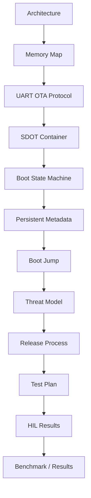

# Documentation Index

> **Scope:** Design specifications, protocol contracts, recovery rules, validation evidence, command references, and portfolio-facing summaries for the Secure Delta OTA Bootloader.

[← Root README](../README.md)

## Table of contents

- [Core design](#core-design)
- [Security and release](#security-and-release)
- [Verification and results](#verification-and-results)
- [Portfolio views](#portfolio-views)
- [Recommended reading order](#recommended-reading-order)

## Core design

| Document | What it answers |
|---|---|
| [Architecture](architecture.md) | Which component owns each responsibility and trust boundary? |
| [Memory Map](memory-map.md) | Where do bootloader, application, metadata, artifact, reconstruction, and backup live? |
| [UART OTA Protocol](uart-ota-protocol.md) | What exactly is exchanged between ESP32 and STM32? |
| [Firmware Container](firmware-container.md) | What bytes are signed and what policy is encoded in SDOT v1 + SCX1? |
| [Boot State Machine](boot-state-machine.md) | How does persistent update state drive reset recovery? |
| [Metadata and Boot Decision](metadata-and-boot-decision.md) | How are A/B metadata records committed and selected? |
| [Boot Jump](boot-jump.md) | How is the Cortex-M3 application vector validated and transferred safely? |
| [External SPI Flash](external-spi-flash.md) | How is W25Q storage wired, partitioned, and protected? |

## Security and release

| Document | Focus |
|---|---|
| [Threat Model](threat-model.md) | Assets, trust boundaries, addressed threats, non-goals |
| [Release Process](release-process.md) | Immutable release creation, key custody, full/delta selection |
| [Toolchain Selection](toolchain-selection.md) | GCC/Clang selection and reproducibility boundary |
| [Make Command Reference](make-command-reference.md) | Public root targets and operational commands |

## Verification and results

| Document | Focus |
|---|---|
| [Test Plan](test-plan.md) | Required functional, recovery, and security checks |
| [HIL Results](hil-results.md) | Physical 9-scenario deterministic fault matrix |
| [Results Report](results-report.md) | Consolidated hardware, security, footprint, delta, release results |
| [Benchmark Guide](benchmark-portfolio.md) | What is measured and what is safe to claim |

## Portfolio views

| Document | Use |
|---|---|
| [One-Page Summary](portfolio-one-page.md) | Fast technical overview |
| [5-Minute Demo](portfolio-demo.md) | Short demonstration flow |
| [Claim / Evidence Map](portfolio-evidence.md) | Maps each project claim to source/test/evidence |

## Recommended reading order

[← Root README](../README.md)
