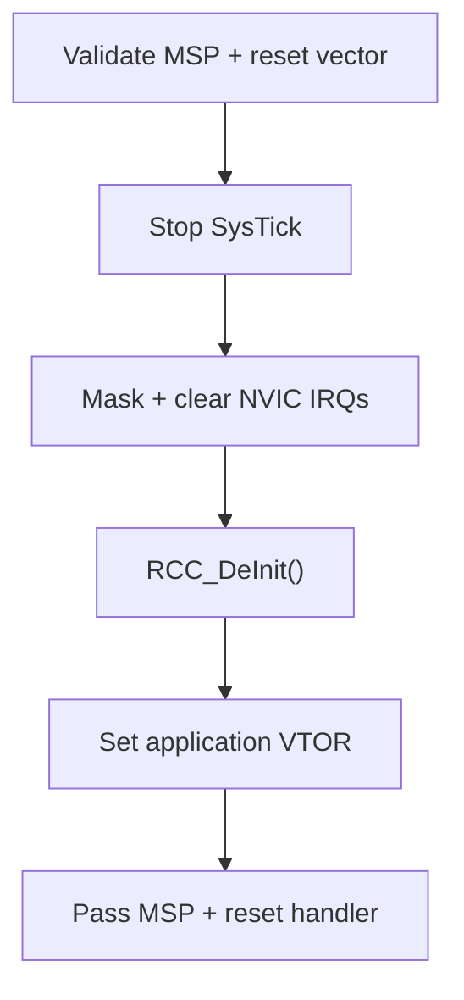
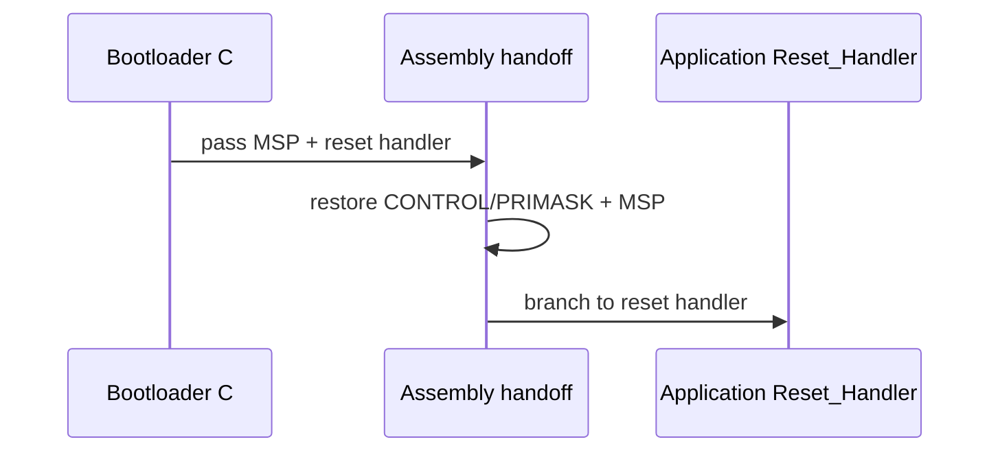

# Bootloader-to-Application Handoff

[↑ Documentation Index](README.md) · [← Root](../README.md) · [← Metadata / Boot Decision](metadata-and-boot-decision.md) · [External SPI Flash →](external-spi-flash.md)

## Table of contents

- [Memory contract](#memory-contract)
- [Validation order](#validation-order)
- [Cleanup and transfer](#cleanup-and-transfer)
- [Why interrupts are re-enabled before the branch](#why-interrupts-are-re-enabled-before-the-branch)
- [Application proof](#application-proof)
## Memory contract

```text
Bootloader vector table   0x08000000
Application vector table  0x08006000
Application end           0x0800FBFF
Metadata page             0x0800F800
SRAM                      0x20000000–0x20004FFF
Initial top of stack      0x20005000
```

The application linker script locates `.isr_vector` exactly at `0x08006000`.
Its first word is `_estack`; its second word is `Reset_Handler` with the Thumb
bit set by the assembler/linker.

## Validation order

```text
Read vector[0] and vector[1]
        |
        v
Vector address aligned to 0x200?
        |
        v
MSP inside SRAM, inclusive of top-of-stack?
        |
        v
MSP aligned to 8 bytes?
        |
        v
Reset handler has Thumb bit?
        |
        v
Reset handler code address inside application partition?
        |
        v
Application is structurally jumpable
```

These are structural checks only. Cryptographic image validation is added in a
secure-container path.

### Handoff sequence

The handoff has a C-side cleanup stage followed by a minimal assembly transfer.

**C-side cleanup**



**Final stack/control transfer**



## Cleanup and transfer

`ApplicationJump_Execute()` performs the handoff in this order:

1. cache vector values in local registers/variables;
2. disable SysTick and clear its counter;
3. mask interrupts;
4. disable and clear all NVIC banks;
5. clear pending SysTick and PendSV;
6. return RCC to a reset-like HSI state;
7. write `SCB->VTOR = 0x08006000`;
8. execute DSB and ISB barriers;
9. call a stackless assembly handoff helper;
10. load application MSP;
11. clear PSP, CONTROL, BASEPRI, FAULTMASK and PRIMASK;
12. branch to the application reset handler with `BX`.

The final MSP change and branch are implemented in assembly so the compiler
cannot emit a function epilogue that accesses the bootloader stack after MSP has
changed.

## Why interrupts are re-enabled before the branch

The bootloader temporarily sets PRIMASK while cleaning the interrupt state.
A hardware reset starts with PRIMASK clear, and the application startup code
does not normally clear it. The assembly helper therefore restores PRIMASK to
zero immediately before branching. Because SysTick and NVIC pending state have
already been cleared, no stale bootloader interrupt can execute during the
handoff.

## Application proof

The boot metadata application:

- verifies `SCB->VTOR == 0x08006000`;
- configures SysTick for 1 ms ticks;
- drives a 100 ms active-low PC13 pulse every second.

The heartbeat therefore demonstrates both successful reset-handler entry and
working interrupt dispatch through the relocated application vector table.

## References

- [`application_jump.c`](../node-stm32f103/bootloader/src/application_jump.c)
- [`application_handoff.s`](../node-stm32f103/bootloader/startup/application_handoff.s)
- [`memory_map.h`](../shared/include/memory_map.h)

[↑ Documentation Index](README.md) · [← Root](../README.md) · [← Metadata / Boot Decision](metadata-and-boot-decision.md) · [External SPI Flash →](external-spi-flash.md)
