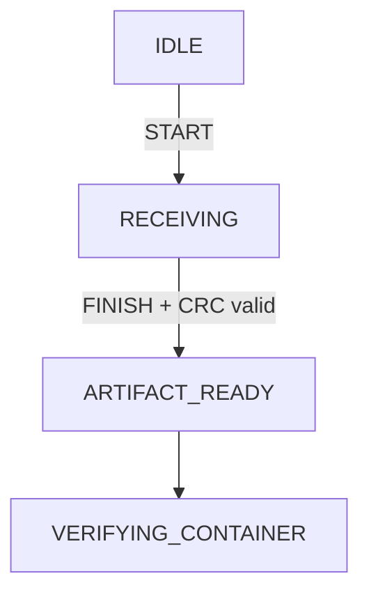
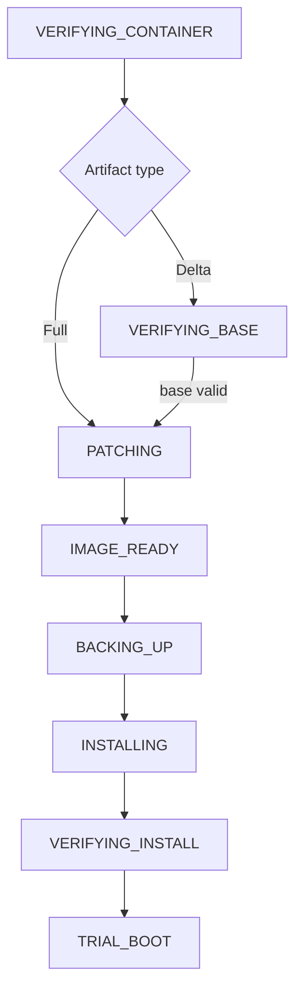
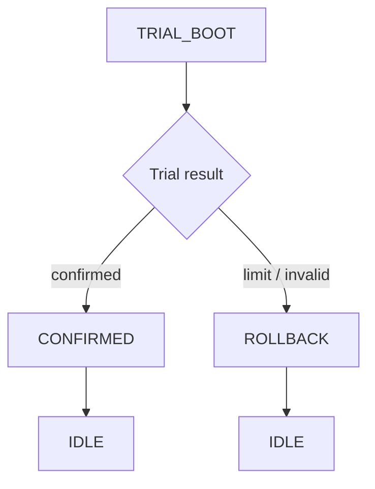

# Boot and Update State Machine

[↑ Documentation Index](README.md) · [← Root](../README.md) · [← Firmware Container](firmware-container.md) · [Metadata / Boot Decision →](metadata-and-boot-decision.md)

> **Status:** **Implemented: signed full/delta install, persistent recovery, trial boot and rollback**

## Table of contents

- [1. Update states](#1-update-states)
- [2. High-level transition diagram](#2-high-level-transition-diagram)
- [Implemented trial boot and rollback path](#implemented-trial-boot-and-rollback-path)
- [3. Boot decision order](#3-boot-decision-order)
- [4. Metadata design](#4-metadata-design)
- [5. Application validity](#5-application-validity)
- [6. Trial boot policy](#6-trial-boot-policy)
- [7. Power-loss guarantees](#7-power-loss-guarantees)
- [8. Illegal transitions](#8-illegal-transitions)
## 1. Update states

```c
typedef enum
{
    UPDATE_IDLE = 0,

    UPDATE_RECEIVING,
    UPDATE_ARTIFACT_READY,

    UPDATE_VERIFYING_CONTAINER,
    UPDATE_VERIFYING_BASE,
    UPDATE_PATCHING,
    UPDATE_IMAGE_READY,

    UPDATE_BACKING_UP,
    UPDATE_INSTALLING,
    UPDATE_VERIFYING_INSTALL,

    UPDATE_TRIAL_BOOT,
    UPDATE_CONFIRMED,

    UPDATE_ROLLBACK,
    UPDATE_FAILED
} UpdateState_t;
```

## 2. High-level transition diagram

```text
IDLE
  |
  | START
  v
RECEIVING ------------------------------+
  | DATA / resume                       |
  | FINISH + artifact CRC valid         | ABORT / unrecoverable error
  v                                     |
ARTIFACT_READY                           |
  | reset / INSTALL                     |
  v                                     |
VERIFYING_CONTAINER                     |
  | valid                               |
  +-----------------------+             |
  |                       |             |
  | delta                 | full        |
  v                       |             |
VERIFYING_BASE            |             |
  | base matches          |             |
  v                       |             |
PATCHING                  |             |
  | target hash valid     |             |
  +-----------+-----------+             |
              v                         |
         IMAGE_READY                    |
              |                         |
              v                         |
         BACKING_UP                     |
              | backup verified         |
              v                         |
         INSTALLING                     |
              |                         |
              v                         |
      VERIFYING_INSTALL                 |
              | installed hash valid    |
              v                         |
         TRIAL_BOOT                     |
          /       \
 confirm           timeout/crash/attempt limit
   |                    |
   v                    v
CONFIRMED            ROLLBACK
   |                    |
   v                    | restore verified backup
 IDLE <-----------------+

Any unrecoverable validation/storage error -> FAILED.
FAILED permits a new START after explicit cleanup.
```


### Focused persisted-state flows

The persisted boot process consists of artifact acceptance, candidate preparation, and trial closure.

**Artifact acceptance**



`DATA` and resume operations remain in `RECEIVING`; they update the persisted receive checkpoint rather than creating another boot state.

**Candidate preparation and installation**



**Trial closure**



## Implemented trial boot and rollback path

```text
RECEIVING -> ARTIFACT_READY
                 |
              INSTALL
                 |
              reset
                 v
          [validate source]
                 |
            BACKING_UP
                 |
            INSTALLING
                 |
        VERIFYING_INSTALL
                 |
            TRIAL_BOOT
            /       \
      CONFIRMED    attempt limit /
          |        invalid trial
          v           |
         IDLE      ROLLBACK
                     |
                     v
                    IDLE
```

`active_version` is not promoted when installation finishes. It remains the
last confirmed version until the trial application commits `CONFIRMED`.

Backup progress is committed at 4 KiB W25Q sector boundaries. Install and
rollback progress are committed at 1 KiB internal Flash page boundaries.
Before each trial jump, `boot_attempts` is persisted and IWDG is started.
Maximum unconfirmed attempts remain three.

## 3. Boot decision order

On reset, the bootloader performs:

1. initialize clock minimally, watchdog policy, debug and storage;
2. read internal metadata and external redundant metadata;
3. choose newest valid generation;
4. validate state consistency;
5. execute state recovery action;
6. validate active application before jump.

Decision table:

| Persisted state | Bootloader action |
|---|---|
| IDLE | Validate active application; jump or stay in recovery |
| RECEIVING | Do not install; jump active application so transfer can resume |
| ARTIFACT_READY | Validate/install when requested policy says install; otherwise jump active app |
| VERIFYING_CONTAINER | Restart validation from beginning |
| VERIFYING_BASE | Restart base verification |
| PATCHING | Erase reconstructed partition and restart patch safely |
| IMAGE_READY | Continue with backup |
| BACKING_UP | Restart or resume backup using verified progress metadata |
| INSTALLING | Resume installation from last verified internal page |
| VERIFYING_INSTALL | Re-run complete installed-image verification |
| TRIAL_BOOT | Increment attempt policy and boot target, or rollback when limit reached |
| CONFIRMED | Commit new active version, retire backup per policy, transition IDLE |
| ROLLBACK | Resume restore from backup |
| FAILED | Stay recovery-capable; active valid application may be booted only if policy allows |

## 4. Metadata design

```c
typedef struct
{
    uint32_t magic;
    uint32_t generation;
    uint32_t metadata_version;

    uint32_t state;
    uint32_t active_version;
    uint32_t pending_version;

    uint32_t active_update_id;
    uint32_t received_size;
    uint32_t expected_size;

    uint32_t copy_offset;
    uint32_t boot_attempts;
    uint32_t last_error;

    uint32_t crc32;
} BootMetadata_t;
```

Internal Flash contains complete Metadata A and B records in separate 1 KiB erase pages at `0x0800F800` and `0x0800FC00`. A new record is written to the older/invalid page, read back, CRC-validated and byte-compared. The currently selected page is not erased until a newer verified copy exists. External Metadata A/B contains the 36-byte CRC-protected
application-to-bootloader install handoff at offset `0x000` and, from power-loss recovery,
a 40-byte CRC-protected persistent download checkpoint at offset `0x100`.
The storage layers preserve the other record type across the 4 KiB sector erase.

## 5. Application validity

Before jump, bootloader checks at minimum:

- initial MSP lies inside `0x20000000`–`0x20005000` (top-of-stack inclusive) and is 8-byte aligned;
- reset handler lies inside the application Flash region and has Thumb bit set;
- application size from trusted metadata is nonzero and within bounds;
- installed image hash matches trusted metadata when state requires it.

Jump sequence:

```text
disable interrupts
stop SysTick
reset/disable used peripherals
clear NVIC enable and pending state
set SCB->VTOR = APPLICATION_START_ADDRESS
load MSP from application vector table
branch to application reset handler
```

## 6. Trial boot policy

Initial policy:

- maximum unconfirmed boot attempts: 3;
- backup remains available throughout trial;
- application calls `Boot_ConfirmApplication()` only after essential self-test;
- a watchdog reset before confirmation counts as a failed attempt;
- after the attempt limit, state transitions to ROLLBACK.

Essential self-test should cover enough functionality to decide that the release can operate, but it must not wait indefinitely for optional network availability.

## 7. Power-loss guarantees

### During download

Active internal application is untouched. A redundant external checkpoint is
committed at each complete 4 KiB receive boundary. After reset, the application
restores the newest valid checkpoint, re-erases the first uncheckpointed
Incoming sector, and the PC resumes from that conservative offset.

### During patching

Active application and backup remain untouched. Reconstructed partition is erased and patch restarts or safely resumes according to the final janpatch adapter capability.

### During backup

Internal application remains untouched. Installation cannot start until backup verification succeeds.

### During installation

Progress is committed after each verified internal Flash page. Reset resumes installation from the first unverified page. If source reconstructed image becomes invalid, rollback is attempted from verified backup.

### During rollback

Restore progress is also page-based and idempotent.

## 8. Illegal transitions

Examples that must be rejected:

- DATA while not RECEIVING;
- INSTALL while RECEIVING;
- PATCHING before signature and base checks;
- INSTALLING before backup verification;
- CONFIRMED without TRIAL_BOOT;
- clearing backup before confirmation;
- accepting a different update ID during RECEIVING without ABORT or new START cleanup.

## References

- [`boot_metadata.h`](../shared/include/boot_metadata.h)
- [`boot_decision.c`](../node-stm32f103/bootloader/src/boot_decision.c)
- [`boot_manager.c`](../node-stm32f103/bootloader/src/boot_manager.c)

[↑ Documentation Index](README.md) · [← Root](../README.md) · [← Firmware Container](firmware-container.md) · [Metadata / Boot Decision →](metadata-and-boot-decision.md)
