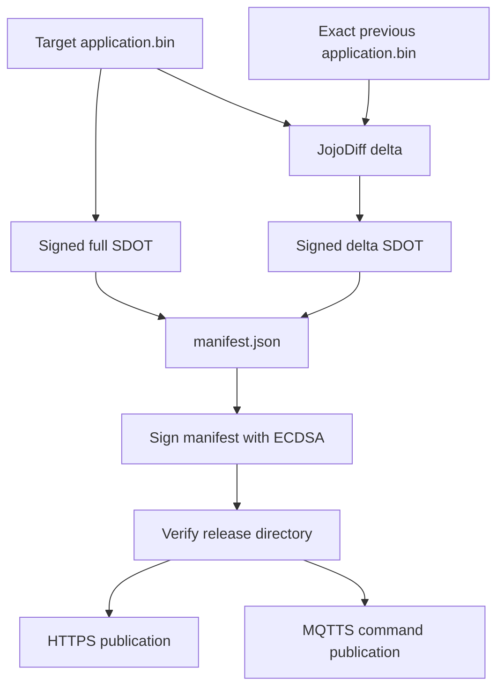

# Firmware Release Process

[↑ Documentation Index](README.md) · [← Root](../README.md) · [← Threat Model](threat-model.md) · [Toolchain Selection →](toolchain-selection.md)

> **Status:** signed immutable release pipeline implemented and validated.

## Table of contents

- [Release directory](#release-directory)
- [Private-key policy](#private-key-policy)
- [Local release](#local-release)
```text
Build target application.bin
        |
        +--------------------------------------+
        |                                      |
        v                                      v
signed full SDOT                    exact previous release .bin
                                               |
                                               v
                                      JojoDiff patch
                                               |
                                               v
                                      signed delta SDOT
        |                                      |
        +--------------------+-----------------+
                             v
                  immutable fw-vN directory
                             |
                manifest.json + ECDSA signature
                             |
                   verify all files/hashes
                             |
                +------------+-------------+
                |                          |
                v                          v
          HTTPS publication          MQTTS command
                                           |
                                           v
                                    ESP32 -> STM32
```

### Release transaction



## Release directory

```text
dist/releases/fw-vN/
├── application-vN.bin
├── application-vN.full.sdot
├── application-vBASE-to-vN.delta.sdot   # only when savings policy passes
├── manifest.json
├── manifest.json.sig
├── signing-public.pem
├── checksums.txt
└── release-notes.md
```

## Private-key policy

- Never commit signing private keys.
- Never copy private signing keys to ESP32 or STM32.
- `tools/release.py` refuses a key inside the repository.
- POSIX key permissions must be `0600` or stricter.
- CI production signing runs only in the protected `firmware-production`
  environment.
- The CI key is materialized only under the ephemeral runner temp directory and
  removed on job exit.
- Release output contains only the public key.
- Production server/publisher configuration separately pins the authorized
  public-key SPKI SHA-256 in `SDOTA_TRUSTED_KEY_SHA256`.
- The protected CI release environment also pins that fingerprint and refuses
  publication if the generated release uses a different key.

## Local release

```bash
python3 tools/release.py \
  --target /path/to/application-v3.bin \
  --target-version 3 \
  --base /path/to/application-v2.bin \
  --base-version 2 \
  --key /secure/location/firmware-signing.pem \
  --key-id 0x14000001 \
  --base-url https://firmware.example \
  --channel stable
```

An existing release directory is never overwritten.

## References

- [`release.py`](../tools/release.py)
- [`manifest_service.py`](../server/app/services/manifest_service.py)
- [`firmware-container.md`](firmware-container.md)

[↑ Documentation Index](README.md) · [← Root](../README.md) · [← Threat Model](threat-model.md) · [Toolchain Selection →](toolchain-selection.md)
