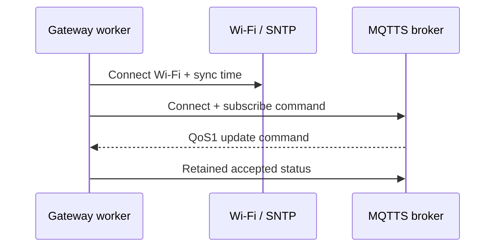
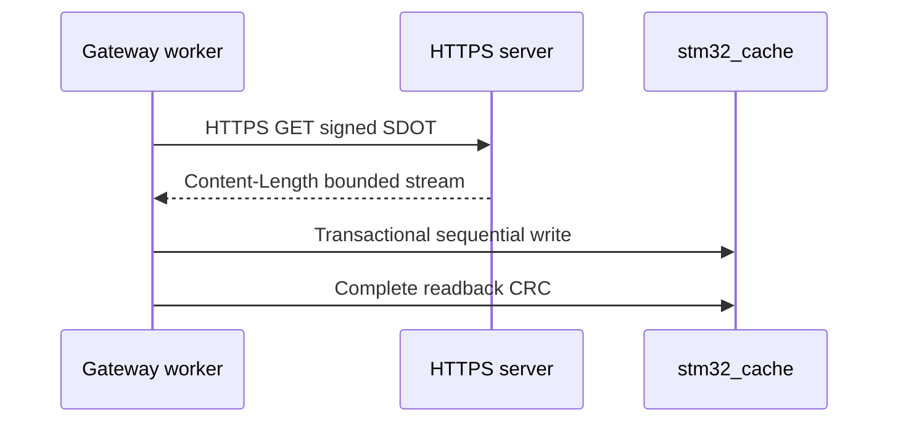
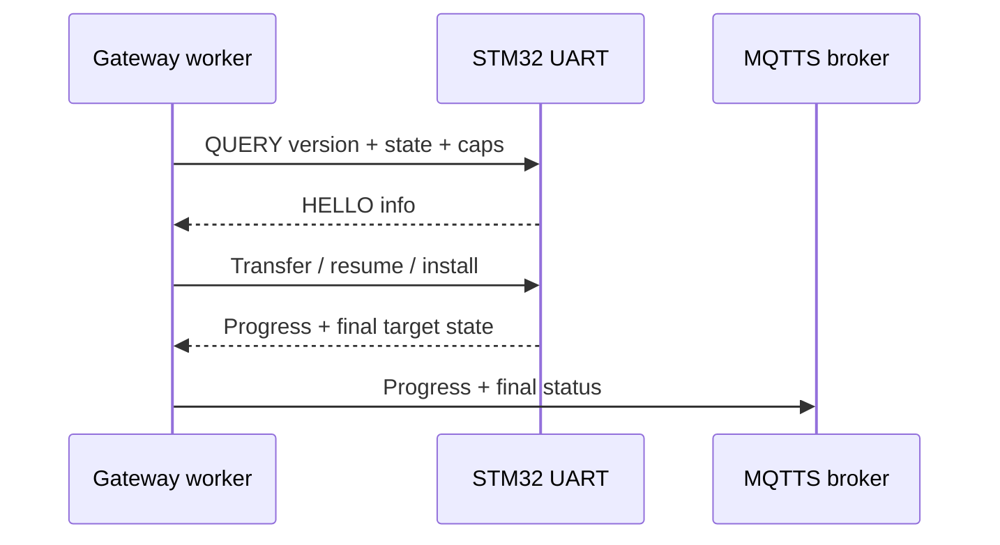
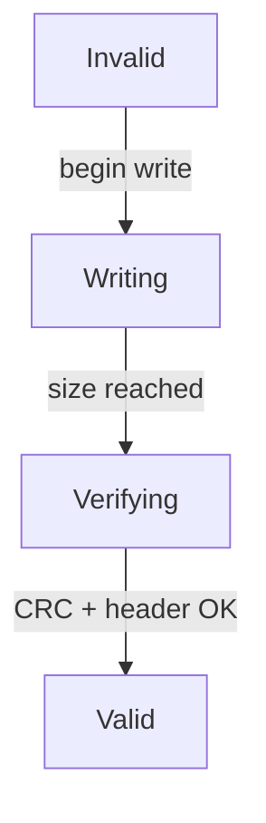

# ESP32 OTA Gateway

> **Scope:** ESP-IDF network/orchestration bridge that receives MQTTS update commands, downloads signed SDOT artifacts over HTTPS, commits them to a persistent cache, and transfers/resumes them to STM32 over the custom UART OTA protocol.

[← STM32 Node](../node-stm32f103/README.md) · [Root README](../README.md) · [Release Server →](../server/README.md)

## Table of contents

- [Runtime pipeline](#runtime-pipeline)
- [Trust role](#trust-role)
- [Persistent artifact cache](#persistent-artifact-cache)
- [MQTT contract](#mqtt-contract)
- [HTTPS policy](#https-policy)
- [UART transfer](#uart-transfer)
- [ESP32 partition table](#esp32-partition-table)
- [Configuration](#configuration)
- [Components](#components)
- [Build](#build)

## Runtime pipeline

`app_main()` creates a dedicated gateway worker task with the configured stack size (default `16384` bytes). The worker calls `GatewayManager_Run()`.

The gateway worker performs connectivity/orchestration, artifact acquisition, and STM32 delivery as separate runtime stages.

**Connectivity and command acceptance**



**HTTPS acquisition into persistent cache**



**STM32 transfer and status publication**



The gateway progress callbacks publish coarse progress (roughly each additional 10% or completion) for `https` and `uart` stages.

## Trust role

The gateway is **not** the final firmware trust anchor. It enforces transport and orchestration policy:

- requires `mqtts://` configuration;
- verifies broker/server certificates through the configured certificate source;
- requires `https://` artifact URLs;
- validates HTTP status, Content-Length, maximum size, streamed byte count, and artifact CRC32;
- validates command schema/ranges;
- preserves the artifact in a transactional cache before UART transfer.

The STM32 bootloader independently parses and verifies the signed SDOT container before installation.

## Persistent artifact cache

`artifact_cache` uses the `stm32_cache` data partition. Artifact bytes begin at offset `0x1000`; the first sector holds a CRC-protected cache header.



While `Writing` is active, sequential chunks update the streaming CRC without changing cache state. Abort/reset before header commit returns the cache to `Invalid`; verification failure also returns to `Invalid`. Starting a new download from `Valid` invalidates the old header before entering `Writing`.

`ArtifactCache_Open()` refuses a cache whose header is invalid and recomputes the complete image CRC before exposing it as a UART artifact.

## MQTT contract

Topics are derived from `base` and `device_id`:

```text
<base>/<device_id>/command
<base>/<device_id>/status
<base>/<device_id>/progress
```

Default names are `sdota/bluepill-001/...`.

Command schema v1 contains:

```json
{
  "schema": 1,
  "cmd": "update",
  "update_id": 2953510913,
  "target_version": 2,
  "size": 1174,
  "crc32": 123456789,
  "url": "https://firmware.example/releases/fw-v2/application-v1-to-v2.delta.sdot"
}
```

The orchestrator bounds command URLs to `255` bytes and reconstructed MQTT payloads to `767` bytes. The command queue length is `1`, which intentionally serializes update execution. MQTT event callbacks reassemble/validate/enqueue commands; they do not perform HTTPS or UART work inside the MQTT callback context.

Status is published QoS 1. Final status can wait for the corresponding PUBACK before single-shot teardown. Progress is lower-cost telemetry and does not redefine the install truth maintained by STM32.

## HTTPS policy

`https_download` streams the response directly into the cache and enforces:

- `https://` URL;
- TLS server verification;
- HTTP `200`;
- positive non-chunked Content-Length;
- caller-supplied maximum image size (`128 KiB` in the gateway manager);
- timeout bound;
- exact downloaded byte count;
- cache commit only after stored-image verification.

Production can use the ESP certificate bundle. Deterministic HIL uses an explicitly embedded temporary test CA certificate generated on the host.

## UART transfer

The `uart_ota` component mirrors the STM32 protocol constants:

- 115200 8-N-1;
- COBS + `0x00` delimiter;
- 16-byte header + 256-byte max payload + 4-byte CRC32;
- ACK/NACK;
- 1500 ms normal response timeout;
- five retries;
- persistent resume based on STM32-reported state and offset.

The portable transfer-plan selector can choose:

```text
ALREADY_TARGET
START_NEW
RESUME
INSTALL_READY
WAIT_TARGET
ABORT_FOREIGN
ERROR
```

`UartOta_TransferInstallAndWait()` carries one cached artifact through transfer/install and waits for the target to become confirmed or for a failure/rollback outcome.

## ESP32 partition table

| Partition | Offset | Size | Purpose |
|---|---:|---:|---|
| `nvs` | `0x9000` | `0x6000` | ESP-IDF NVS |
| `phy_init` | `0xF000` | `0x1000` | PHY init data |
| `factory` | `0x10000` | `0x180000` | gateway application |
| `stm32_cache` | `0x190000` | `0x30000` | committed STM32 artifact cache |

## Configuration

`main/Kconfig.projbuild` defines the production/test knobs. Important defaults:

| Setting | Default |
|---|---:|
| STM32 UART | UART2 |
| TX GPIO | 17 |
| RX GPIO | 16 |
| Worker stack | 16384 B |
| Autorun | enabled |
| Single-shot | disabled |
| Wi-Fi timeout | 30000 ms |
| SNTP timeout | 20000 ms |
| HTTPS timeout | 15000 ms |
| MQTT ready timeout | 30000 ms |
| MQTT command timeout | wait forever (`0`) |

`main/include/runtime_config.h` is checked in with runtime overrides disabled and empty credentials. The HIL runner may temporarily generate an override during a test and restores repository state afterward.

## Components

| Component | Status / role |
|---|---|
| [artifact_cache](components/artifact_cache/README.md) | implemented persistent transactional cache |
| [https_download](components/https_download/README.md) | implemented authenticated HTTPS stream |
| [mqtt_orchestrator](components/mqtt_orchestrator/README.md) | implemented command/status/progress orchestration |
| [uart_ota](components/uart_ota/README.md) | implemented UART protocol/client |
| `secure_container_meta` | implemented lightweight SDOT metadata parser used by gateway checks |
| `time_sync` | implemented SNTP/test-time synchronization |
| `wifi_station` | implemented Wi-Fi station connection/retry |
| [device_manager](components/device_manager/README.md) | reserved scaffold; not linked into current runtime |
| [https_downloader](components/https_downloader/README.md) | reserved legacy scaffold; replaced by `https_download` |
| [manifest_parser](components/manifest_parser/README.md) | reserved scaffold; release selection is server-side in current design |
| [mqtt_service](components/mqtt_service/README.md) | reserved scaffold; replaced by `mqtt_orchestrator` |
| [storage](components/storage/README.md) | reserved scaffold; cache persistence is in `artifact_cache` |
| [telemetry](components/telemetry/README.md) | reserved scaffold; progress/status publishing is in `mqtt_orchestrator` |
| [update_scheduler](components/update_scheduler/README.md) | reserved scaffold; current worker serializes one command at a time |

## Build

```bash
source ~/esp/esp-idf/export.sh
make gateway
```

or:

```bash
cd gateway-esp32
idf.py build
```

The root build guard checks the checked-in configuration/security boundary before invoking ESP-IDF.

## References

- [System architecture](../docs/architecture.md)
- [UART OTA protocol](../docs/uart-ota-protocol.md)
- [Release server](../server/README.md)
- [`main/gateway_manager.c`](main/gateway_manager.c)
- [`main/Kconfig.projbuild`](main/Kconfig.projbuild)
