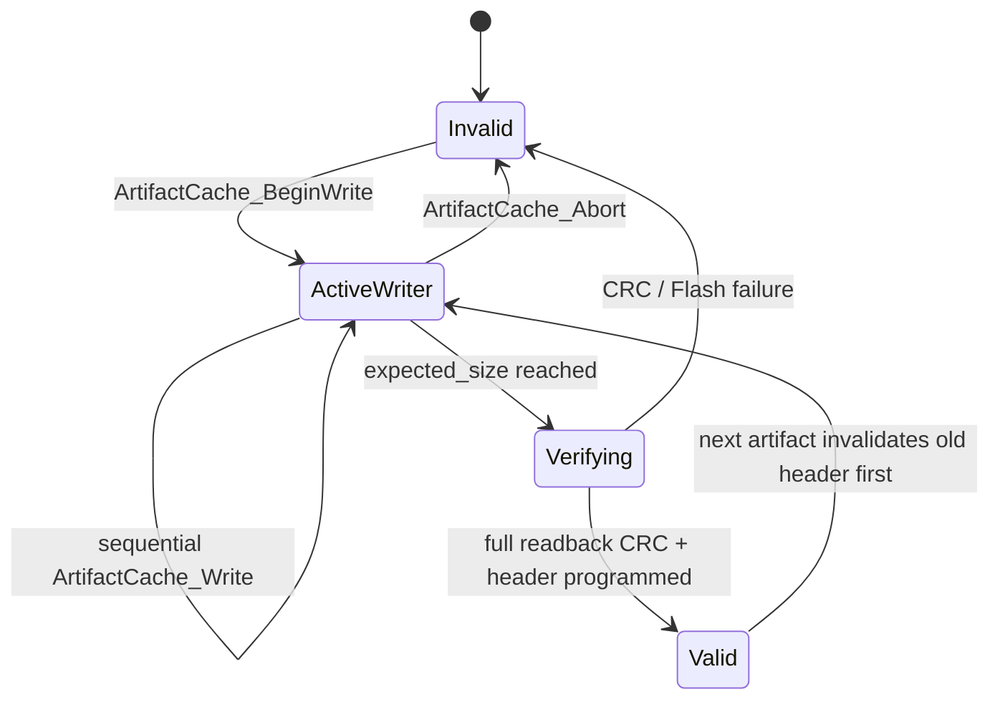

# `artifact_cache`

> **Scope:** Transactional persistent cache for one complete STM32 SDOT artifact in the ESP32 `stm32_cache` partition.

[← Gateway](../../README.md) · [HTTPS Download →](../https_download/README.md)

## Contract

The cache has two regions: a header sector and artifact data beginning at `0x1000`.

| Constant | Value |
|---|---|
| Partition label | `stm32_cache` |
| Data offset | `0x1000` |
| Header magic | `0x39414347` (`GCA9`) |
| Format version | `1` |
| Header size | `36 B` |

The header records `update_id`, `target_version`, image size, image CRC32, data offset, and a header CRC32.

## Transaction model

The important power-loss rule is **header last**. A reset before the header commit leaves no valid cache record. `ArtifactCache_Open()` validates the header and recomputes the complete stored image CRC before returning a usable cache.

## UART bridge

`ArtifactCache_AsUartArtifact()` exposes the committed cache through the `UartOtaArtifact_t` read callback without copying the entire image into RAM.

## Implementation references

- [`include/artifact_cache.h`](include/artifact_cache.h)
- [`artifact_cache.c`](artifact_cache.c)
- [Gateway README](../../README.md)
