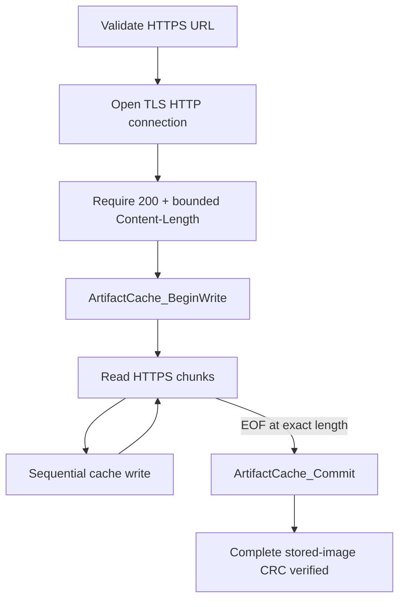

# `https_download`

> **Scope:** Authenticated HTTPS GET streamed directly into `artifact_cache` with bounded size, deterministic completion checks, and no whole-image RAM buffer.

[← Artifact Cache](../artifact_cache/README.md) · [Gateway](../../README.md) · [MQTT Orchestrator →](../mqtt_orchestrator/README.md)

## Download policy

`HttpsDownload_ToCache()` requires:

- `https://` URL;
- valid TLS verification configuration;
- HTTP status `200`;
- positive `Content-Length`;
- no chunked body;
- response size within `max_image_size`;
- completion before timeout;
- exact byte count;
- successful cache commit and stored-image CRC verification.

The transfer buffer is `1024 B`; artifact persistence is streamed.

Production uses the ESP x509 certificate bundle when configured. HIL can instead embed a host-generated public test CA certificate; the private CA key remains on the host.

## Implementation references

- [`include/https_download.h`](include/https_download.h)
- [`https_download.c`](https_download.c)
- [`https_download_policy.c`](https_download_policy.c)
