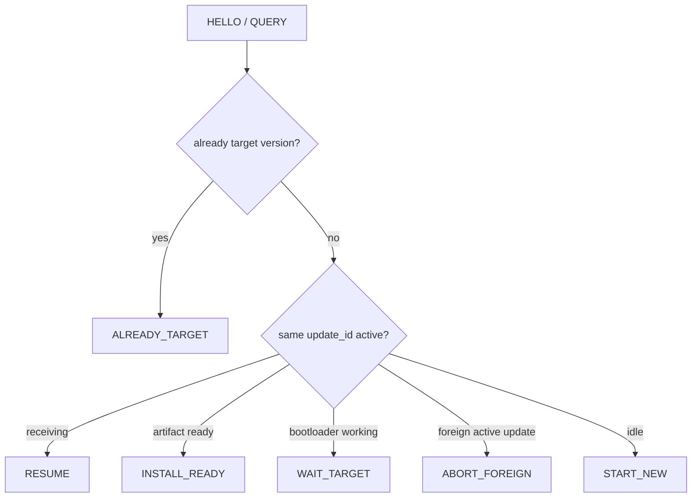

# `uart_ota`

> **Scope:** ESP-IDF UART client plus portable wire codec/transfer-plan logic for the STM32 OTA protocol v1.

[← MQTT Orchestrator](../mqtt_orchestrator/README.md) · [Gateway](../../README.md)

## Wire contract

| Property | Value |
|---|---|
| UART | 115200 8-N-1 |
| Framing | COBS + `0x00` |
| Magic | `0xA55A` |
| Protocol version | `1` |
| Header | `16 B` |
| Max payload | `256 B` |
| CRC | IEEE CRC32, `4 B` |
| Max encoded frame | `320 B` |
| Normal response timeout | `1500 ms` |
| Retry count | `5` |

The ESP32 definitions intentionally mirror the STM32 protocol values.

## Transfer planning

Before transfer, the gateway queries the STM32 and selects one action from the target's persisted state:

The client handles START/DATA/FINISH/INSTALL, ACK/NACK retries, persistent receive resume, reset/reconnect windows, and final confirmed/rollback observation.

## Portable tests

The wire codec and `UartOta_SelectPlan()` are portable C and are exercised by host tests independently of ESP-IDF.

## Implementation references

- [`include/uart_ota_protocol.h`](include/uart_ota_protocol.h)
- [`include/uart_ota_plan.h`](include/uart_ota_plan.h)
- [`uart_ota_protocol.c`](uart_ota_protocol.c)
- [`uart_ota_plan.c`](uart_ota_plan.c)
- [`uart_ota_client.c`](uart_ota_client.c)
- [Protocol specification](../../../docs/uart-ota-protocol.md)
