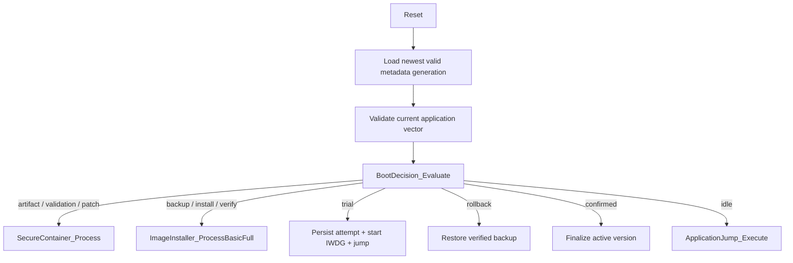
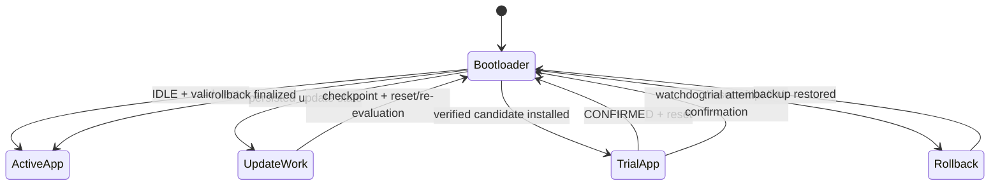

# STM32F103 Node

> **Scope:** Bare-metal/SPL STM32F103C8T6 application + immutable OTA bootloader, with W25Q staging, signed SDOT validation, delta reconstruction, power-loss recovery, trial boot, and rollback.

[← Root README](../README.md) · [Documentation](../docs/README.md) · [ESP32 Gateway →](../gateway-esp32/README.md)

## Table of contents

- [Memory ownership](#memory-ownership)
- [Application responsibilities](#application-responsibilities)
- [Bootloader responsibilities](#bootloader-responsibilities)
- [Persistent storage model](#persistent-storage-model)
- [Reset-to-application path](#reset-to-application-path)
- [Hardware interfaces](#hardware-interfaces)
- [Build](#build)
- [Implementation references](#implementation-references)

## Memory ownership

```text
Internal Flash
0x08000000 +-----------------------+
             | Bootloader 24 KiB  |
0x08006000 +-----------------------+
             | Application 38 KiB |
0x0800F800 +-----------------------+
             | Metadata A 1 KiB   |
0x0800FC00 +-----------------------+
             | Metadata B 1 KiB   |
0x08010000 +-----------------------+
```

The application never installs into its own active region. Incoming and reconstructed firmware live in external SPI NOR until the bootloader has validated the update and backed up the active image.

## Application responsibilities

`application/src/main.c` owns the normal application runtime shell:

- sets `SCB->VTOR` contract expectation to `0x08006000`;
- runs a 1 ms SysTick;
- initializes the UART OTA agent;
- restores receive state from external download checkpoints;
- processes COBS-framed OTA packets in the main loop;
- stages bytes in the incoming W25Q partition;
- persists `UPDATE_ARTIFACT_READY` + install handoff before reset;
- observes `UPDATE_TRIAL_BOOT` after a candidate boot;
- automatically confirms after `750 ms` of successful startup/runtime initialization unless the deterministic HIL build disables confirmation;
- persists `UPDATE_CONFIRMED` and resets so the bootloader can finalize the version.

The receive path supports full, delta, and signed SDOT artifacts, but the secure build ultimately delegates firmware authenticity to the bootloader.

## Bootloader responsibilities

`bootloader/src/boot_manager.c` is the reset-time coordinator. Its decision is derived from CRC-protected A/B metadata and current application-vector validity.



Before jumping, the bootloader validates:

- vector-table alignment/range;
- initial MSP range and 8-byte alignment;
- Thumb bit on reset vector;
- reset handler address inside the application region.

The handoff stops SysTick, disables/clears NVIC interrupts, resets RCC to an HSI-like state, updates `VTOR`, then uses assembly to set MSP and branch without a compiler-generated stack frame.

## Persistent storage model

Internal metadata contains update state, active/pending version, update ID, receive/install progress, boot attempts, diagnostic error, generation, and CRC32. Commits always target the non-selected/older slot, program a complete finalized record, read it back, validate it, and only then allow it to become the newest generation.

External W25Q storage provides:

- redundant install handoff;
- redundant download checkpoint;
- incoming SDOT;
- reconstructed target;
- validated backup;
- self-test sector.

The W25Q driver uses SPI1 on PA5/PA6/PA7 with PB0 as active-low chip select and supports the JEDEC IDs accepted by the project.

## Reset-to-application path



The key invariant is that the last confirmed application version remains authoritative until the candidate survives the trial-confirmation contract.

## Hardware interfaces

| Function | STM32 resource |
|---|---|
| ESP32 OTA TX/RX | USART1 PA9/PA10 |
| W25Q SCK | SPI1 PA5 |
| W25Q MISO | SPI1 PA6 |
| W25Q MOSI | SPI1 PA7 |
| W25Q CS | PB0 |
| Status LED | PC13, active low |
| Debug/programming | SWD/ST-Link |

## Build

From the repository root:

```bash
make bootloader TOOLCHAIN=gcc
make application TOOLCHAIN=gcc
make combined TOOLCHAIN=gcc
```

Or directly:

```bash
make -C node-stm32f103/bootloader TOOLCHAIN=gcc
make -C node-stm32f103/application TOOLCHAIN=gcc
```

The same common make logic can select Clang/LLVM when requested.

## Implementation references

- [Memory map](../docs/memory-map.md)
- [Boot state machine](../docs/boot-state-machine.md)
- [Metadata and boot decision](../docs/metadata-and-boot-decision.md)
- [Boot jump](../docs/boot-jump.md)
- [Firmware container](../docs/firmware-container.md)
- [`shared/include/boot_metadata.h`](../shared/include/boot_metadata.h)
- [`bootloader/src/boot_manager.c`](bootloader/src/boot_manager.c)
- [`application/src/ota_receiver.c`](application/src/ota_receiver.c)
