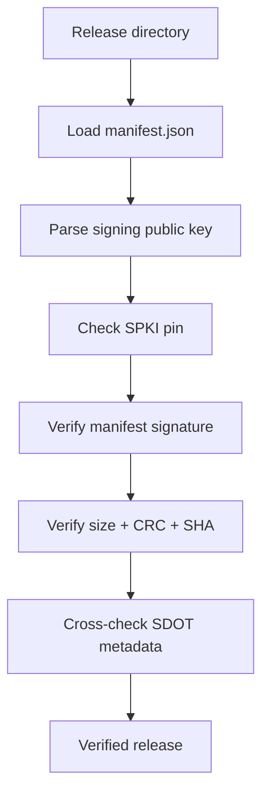

# Firmware Release Server

> **Scope:** Standard-library Python command-line service for verifying immutable releases, serving allow-listed files over HTTPS, selecting full/delta artifacts, and publishing update commands over MQTTS QoS 1.

[← ESP32 Gateway](../gateway-esp32/README.md) · [Root README](../README.md) · [Release Process](../docs/release-process.md)

## Table of contents

- [Security model](#security-model)
- [Commands](#commands)
- [Release verification](#release-verification)
- [HTTPS serving](#https-serving)
- [Artifact selection](#artifact-selection)
- [MQTT publication](#mqtt-publication)
- [Directory structure](#directory-structure)

## Security model

The server does not authorize a release merely because that release contains a public key. Production serving/command publication pins the authorized public-key SPKI SHA-256 independently:

```bash
export SDOTA_TRUSTED_KEY_SHA256=<64-hex-SPKI-SHA256>
```

`verify_release_directory()` checks:

1. manifest schema and release directory identity;
2. included public-key SPKI SHA-256 against the manifest;
3. optional/required external trusted-key fingerprint pin;
4. detached ECDSA signature on `manifest.json`;
5. file size, CRC32, SHA-256 for every artifact;
6. each SDOT's internal format/size/version/CRC metadata against the manifest.

This is a publication trust boundary; the STM32 bootloader still independently authenticates the SDOT before installation.

## Commands

### Verify

```bash
python3 server/app/main.py verify \
  --release-root dist/releases \
  --release-id fw-v3 \
  --trusted-key-sha256 "$SDOTA_TRUSTED_KEY_SHA256"
```

### Serve HTTPS

```bash
python3 server/app/main.py serve \
  --release-root dist/releases \
  --bind 0.0.0.0 \
  --port 8443 \
  --cert /etc/sdota/server.pem \
  --key /etc/sdota/server.key \
  --trusted-key-sha256 "$SDOTA_TRUSTED_KEY_SHA256"
```

### Print selected command

```bash
python3 server/app/main.py command \
  --release-root dist/releases \
  --release-id fw-v3 \
  --current-version 2 \
  --device-id bluepill-001 \
  --trusted-key-sha256 "$SDOTA_TRUSTED_KEY_SHA256"
```

### Publish command over MQTTS

```bash
python3 server/app/main.py publish \
  --release-root dist/releases \
  --release-id fw-v3 \
  --current-version 2 \
  --device-id bluepill-001 \
  --broker-uri mqtts://mqtt.example:8883 \
  --ca /etc/sdota/mqtt-ca.pem \
  --trusted-key-sha256 "$SDOTA_TRUSTED_KEY_SHA256"
```

## Release verification



The release directory name must equal `release_id`; a release must contain exactly one full artifact, and delta selectors `(kind, base_version)` must be unique.

## HTTPS serving

The server is a TLS-wrapped `ThreadingHTTPServer` with TLS 1.2 minimum. It intentionally provides no directory listing.

Allowed routes:

```text
GET/HEAD /healthz
GET/HEAD /releases/<release-id>/<allowed-file>
```

Allowed file categories include the manifest/signature/checksums/release notes/public key plus `.sdot` and `.bin` artifacts. Path traversal is rejected by normalized path checks.

## Artifact selection

`select_artifact()` chooses:

1. an exact-base delta when `prefer_delta=True` and a delta whose `base_version == current_version` exists;
2. otherwise the mandatory full artifact.

The server rejects a request when the device is already at or newer than the release target.

## MQTT publication

The generated command is compact JSON:

```json
{"cmd":"update","crc32":123,"schema":1,"size":1174,"target_version":3,"update_id":456,"url":"https://..."}
```

`publish_qos1()` opens a TLS MQTT connection, sends CONNECT, requires successful CONNACK, publishes QoS 1 with a packet identifier, and waits for the matching PUBACK before disconnecting.

## Directory structure

```text
server/
├── app/main.py                  CLI entry point
├── app/models/release.py        normalized manifest model
├── app/models/sdot.py           SDOT parser/cross-check model
├── app/services/firmware_service.py
├── app/services/https_service.py
├── app/services/manifest_service.py
├── app/services/mqtt_service.py
├── app/services/signing_service.py
├── schemas/                     JSON schemas
└── tests/                       server test placeholder/assets
```

## References

- [Release Process](../docs/release-process.md)
- [Firmware Container](../docs/firmware-container.md)
- [Threat Model](../docs/threat-model.md)
- [`app/main.py`](app/main.py)
